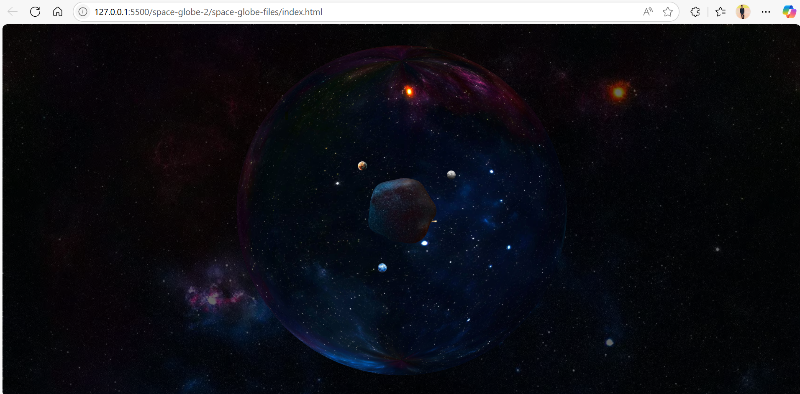

**# 🌌 Interactive 3D Space Globe**

This project is an immersive and interactive 3D space scene created with **Three.js**. It features a dynamic, pulsating central star (nucleus) surrounded by orbiting planets, a comet, and a field of distant stars. Users can explore the scene by rotating, panning, and zooming.

---

## ✨ Features

*   **Interactive 3D Scene:** Built from the ground up using `three.js` for a rich WebGL experience.
*   **Dynamic Star Nucleus:** The central star animates with a mesmerizing noise displacement effect, making it feel alive.
*   **Celestial Bodies:** The scene is populated with multiple planets, a streaking comet, and a vast field of stars, all with their own textures and rotation.
*   **User Interaction:** Implements `OrbitControls` to allow users to freely rotate, pan, and zoom to explore the environment.
*   **Responsive Canvas:** The 3D scene automatically resizes to fit the browser window, ensuring a great experience on any screen size.
*   **Optimized Rendering:** The animation loop is capped at 60 FPS to ensure smooth performance without over-utilizing system resources.

---

## 🔭 Scene Preview

The main view of the project is the 3D space globe itself. It loads directly to the animation, allowing for immediate interaction.

> 💡 Tip: Click and drag to rotate the scene. Use your mouse wheel to zoom in and out.

---

## 🌐 Live Demo

Explore the live version of the space globe here:

[- 🔗 Click here to view the live site on GitHub Pages](https://riteshraut0116.github.io/3D-space-globe-html/)

> 💡 Best viewed on modern browsers like Chrome, Firefox, or Edge.

---

## 📂 Repository Structure

3D_space-globe-files/
│
├── textures/                     # Directory containing texture and background images
│   ├── flare1.png                # Flare texture image
│   ├── flare2.png                # Flare texture image
│   ├── flare3.png                # Flare texture image
│   ├── planet1.webp              # Planet texture image
│   ├── planet2.webp              # Planet texture image
│   ├── planet3.webp              # Planet texture image
│   ├── sky.jpg                   # Sky background image
│   ├── sky1.jpg                  # Alternate sky background image
│   └── star.jpg                  # Star background image
│
├── index.html                    # Main HTML file for webpage structure
├── script.js                     # JavaScript file for interactive globe logic
├── style.css                     # CSS file for styling the webpage
└── README.md                     # Project overview and usage instructions

---

## 🚀 How to Run

1. Download or clone this repository to your local machine.
2. Navigate to the `dist` folder.
3. Open the `index.html` file in a modern web browser (like Chrome, Firefox, or Edge).
4. Explore the scene by clicking, dragging, and scrolling!

---

## 💻 Technologies Used

* HTML5
* CSS3
* JavaScript (ES6 Modules)
* Three.js

---

## 👤 Author

**Ritesh Raut**  
*Programmer Analyst, Cognizant*

🚀 Explore the Cosmos in Your Browser 🌌 — A Real-Time 3D Space Experience Powered by Three.js ✨🪐

---

### 🌐 Connect with me:

---
